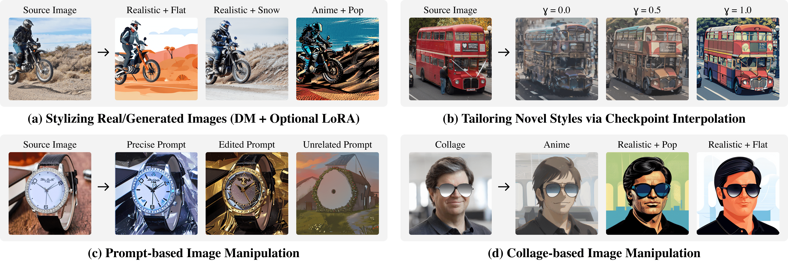

# Ditail
Official implementation for "Diffusion Cocktail: Mixing Domain-Specific Diffusion Models for Diversified Image Generations".

<p align="center">
  
</p>


## Quick Links
 - [Project Page](https://MAPS-research.github.io/Ditail)
 - [Paper Preprint](https://arxiv.org/abs/2312.08873)
 - [HuggingFace Demo](https://huggingface.co/spaces/MAPS-research/Diffusion-Cocktail)
 - [Stable Diffusion WebUI Extension](https://github.com/MAPS-research/sd-webui-ditail)

## Abstract
Diffusion models, capable of high-quality image generation, receive unparalleled popularity for their ease of extension. Active users have created a massive collection of domain-specific diffusion models by fine-tuning base models on self-collected datasets. Recent work has focused on improving a single diffusion model by uncovering semantic and visual information encoded in various architecture components. However, those methods overlook the vastly available set of fine-tuned diffusion models and, therefore, miss the opportunity to utilize their combined capacity for novel generation. In this work, we propose Diffusion Cocktail (Ditail), a training-free method that transfers style and content information between multiple diffusion models. This allows us to perform diversified generations using a set of diffusion models, resulting in novel images unobtainable by a single model. Ditail also offers fine-grained control of the generation process, which enables flexible manipulations of styles and contents. With these properties, Ditail excels in numerous applications, including style transfer guided by diffusion models, novel-style image generation, and image manipulation via prompts or collage inputs.

**TL;DR:** Ditail offers a training-free method for fine-grained manipulations of image content/style via the vastly available domain-specific Diffusion models and LoRAs checkpoints, enabling diversified novel image generations.

## Environment Setup
```bash
# Clone the repo
git clone https://github.com/MAPS-research/Ditail.git && cd Ditail

# Create a new conda environment
conda env create -f env.yml

# Activate and verify
conda activate ditail
conda list
```

## Ditail Demo
Ditail enpowers flexible image style transfer and content manipulation. You may want to play with:
- Content manipulation: `--pos_prompt`, `--neg_prompt`, `--alpha`, `--beta`, `--no_injection`.
- Style transfer: `--inv_model`, `--spl_model`, `--lora`, `--lora_scale`.
- Granularity: `--inv_steps`, `--spl_steps`, `--omega`.
```bash
# Sample usage with editing prompt
python src/ditail_demo.py --img_path ./img/watch.jpg \
    --pos_prompt "a golden leather watch with dial and crystals"

# Sample usage with multiple model checkpoints
# Note: See ./model/README.md for more setup details
python src/ditail_demo.py --img_path ./img/watch.jpg \
    --pos_prompt "a golden leather watch with dial and crystals" \
    --spl_model "stablediffusionapi/pastel-mix-stylized-anime"

# Sample usage with LoRA
# Note: See ./lora/README.md for more setup details
python src/ditail_demo.py --img_path ./img/watch.jpg --lora pop \
    --pos_prompt "a golden leather watch with dial and crystals"
```

## Ditail for Batch Image Manipulation
**Note:** Make sure the dataset is ready, see `./data/README.md`.
```bash
# Sample usage on generated images
# Note: See ./model/README.md for more setup details
python src/ditail_batch.py --data_type gen --exp_id test \
    --inv_model ./model/output/38765 \
    --spl_model ./model/output/97557 \
    --data_dir ./data/gemrec/38765
# => Output dir: ./output/gen_test

# Sample usage on real images with LoRA
# Note: See ./lora/README.md for more setup details
python src/ditail_batch.py --data_type real --exp_id test \
    --data_dir ./data/coco \
    --lora pop
# => Output dir: ./output/real_test
```

## Acknowledgement
This work is supported in part by the Shanghai Frontiers Science Center of Artificial Intelligence and Deep Learning at NYU Shanghai, NYU Shanghai Boost Fund, and NYU HPC resources and services.

## Citation
If you find our work helpful, please consider cite it as follows:
```bibtex
@article{liu2023ditail,
  title={Diffusion Cocktail: Mixing Domain-Specific Diffusion Models for Diversified Image Generations},
  author={Liu, Haoming and Guo, Yuanhe and Wang, Shengjie and Wen, Hongyi},
  journal={arXiv preprint arXiv:2312.08873},
  year={2023}
}
```
